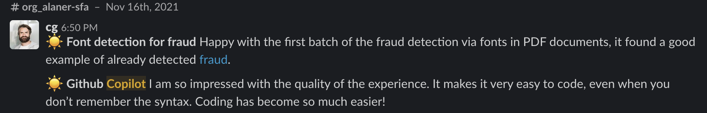
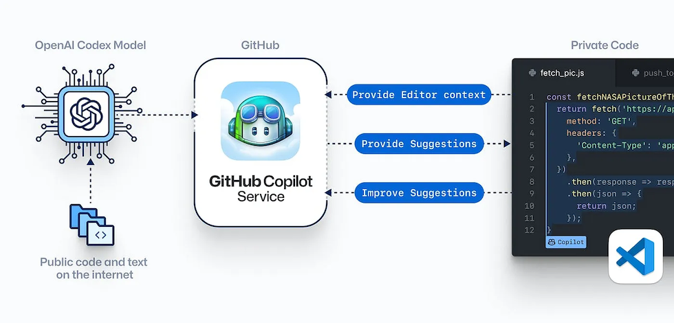
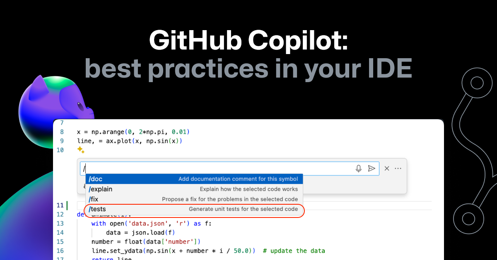
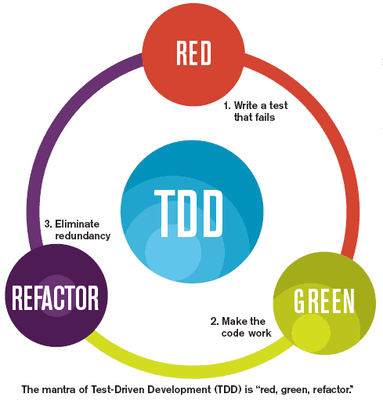

= 🧑‍💻 TDD & IA 🤖
:source-highlighter: highlightjs
:revealjs_theme: white
:revealjs_history: true
:revealjs_plugin_pdf: enabled
:revealjs_plugin_highlight: enabled
:revealjs_progress: true
:customcss: custom.css
:data-uri:
:icons: font

++++

@binout

++++

== Benoit Prioux

image::images/{conf}-background.png[background, size=cover]

icon:twitter[] icon:github[] binout 

== 🧡 Alan, partenaire santé

image::images/{conf}-background.png[background, size=cover]

image:images/Alan-Mascot.png[width=30%]

== 🧑‍💻 IA chez Alan

image::images/{conf}-background.png[background, size=cover]

Charles Gorintin - CTO

== 🚀 Novembre 2021

image::images/{conf}-background.png[background, size=cover]

== ⚙️ Github Copilot

image::images/{conf}-background.png[background, size=cover]

https://medium.com/analytics-vidhya/github-copilot-all-you-need-to-know-8e6fc1d5ccc[Source]

== 💡 Générer des tests: bonne idée! 

image::images/{conf}-background.png[background, size=cover]

https://github.blog/developer-skills/github/how-to-use-github-copilot-in-your-ide-tips-tricks-and-best-practices/[Source]

== 🎬 Essayons en live

image::images/{conf}-background.png[background, size=cover]

DEMO

== 🤔 Vraiment une bonne idée ?

image::images/{conf}-background.png[background, size=cover]

* 🔗 Les tests générés sont dépendants de l'implémentation
* 🐛 Les tests générés testent vos bugs 

➡️ Amplificateur du syndrome du "Test After" 💥

== 🧪 Et TDD dans tout ça ?

image::images/{conf}-background.png[background, size=cover]

== 🙋 Qui sait écrire les tests ? 

image::images/{conf}-background.png[background, size=cover]

== 🤖 Qui peut écrire le code ? 

image::images/{conf}-background.png[background, size=cover]

image:images/copilot.png[]

== 🤖 Qui peut refactorer le code ? 

image::images/{conf}-background.png[background, size=cover]

image:images/copilot.png[]

== 🎬  Essayons en live

image::images/{conf}-background.png[background, size=cover]

DEMO 

== 🔮 Limites des assistants de code

image::images/{conf}-background.png[background, size=cover]

* 🧠 Pas de compréhension du métier
* 🧩 Pas de vision globale du projet
* 🧾 Pas de connaissance des contraintes

== 😉 Générer des tests, ça peut rendre service

image::images/{conf}-background.png[background, size=cover]

* 🧪 Générer des tests pour des cas simples
* 🧑‍🏫 Pour apprendre un framework de test
* 🥋 Pour couvrir du code existant

== Merci 🙏

image::images/{conf}-background.png[background, size=cover]

👨‍🏫 https://binout.github.io/ai-tdd/

➡️ https://alan.com/careers

