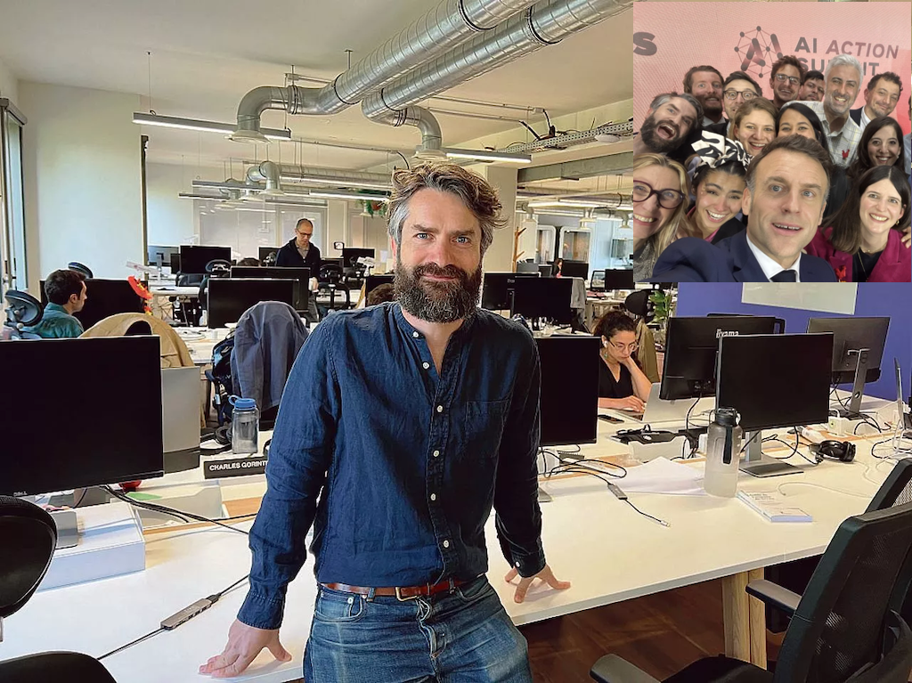

= 🧑‍💻 TDD & IA 🤖
:source-highlighter: highlightjs
:revealjs_theme: white
:revealjs_history: true
:revealjs_plugin_pdf: enabled
:revealjs_plugin_highlight: enabled
:revealjs_progress: true
:customcss: custom.css
:data-uri:
:icons: font

++++

@binout

++++

== Benoit Prioux

image::images/{conf}-background.png[background, size=cover]

icon:twitter[] icon:github[] binout 

image::images/alan-eng.jpeg[]

== 💜 Alan, partenaire santé

image::images/{conf}-background.png[background, size=cover]

image:images/Alan-1.png[width=25%]
image:images/Alan-Mascot.png[width=30%]
image:images/Alan-2.png[width=25%]

== 🧑‍💻 IA chez Alan

image::images/{conf}-background.png[background, size=cover]

Charles Gorintin - CTO

== 🚀 Novembre 2021

image::images/{conf}-background.png[background, size=cover]

== ⚙️ Github Copilot

image::images/{conf}-background.png[background, size=cover]

image:images/copilot.png[]

https://medium.com/analytics-vidhya/github-copilot-all-you-need-to-know-8e6fc1d5ccc[Source]

== Merci 🙏

image::images/{conf}-background.png[background, size=cover]

👨‍🏫 https://binout.github.io/ai-tdd/

image::images/marmot.png[width=20%]

➡️ https://alan.com/careers

